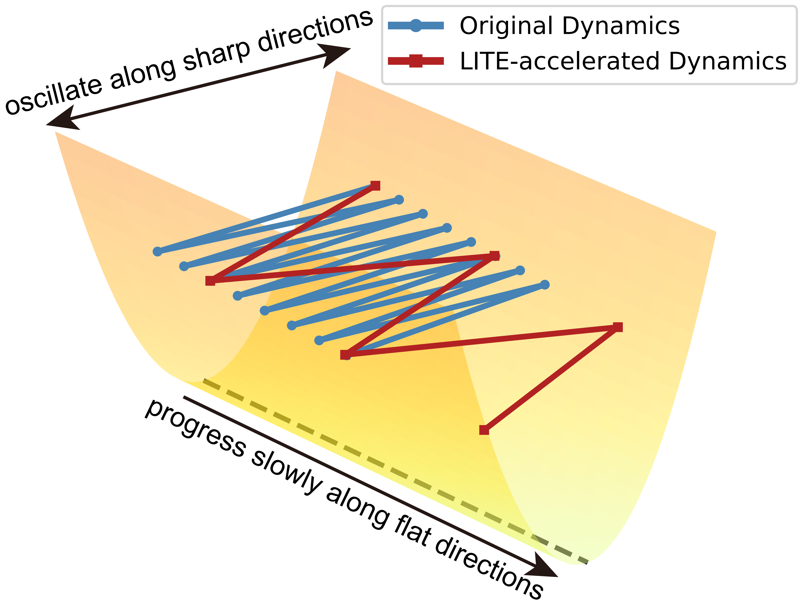
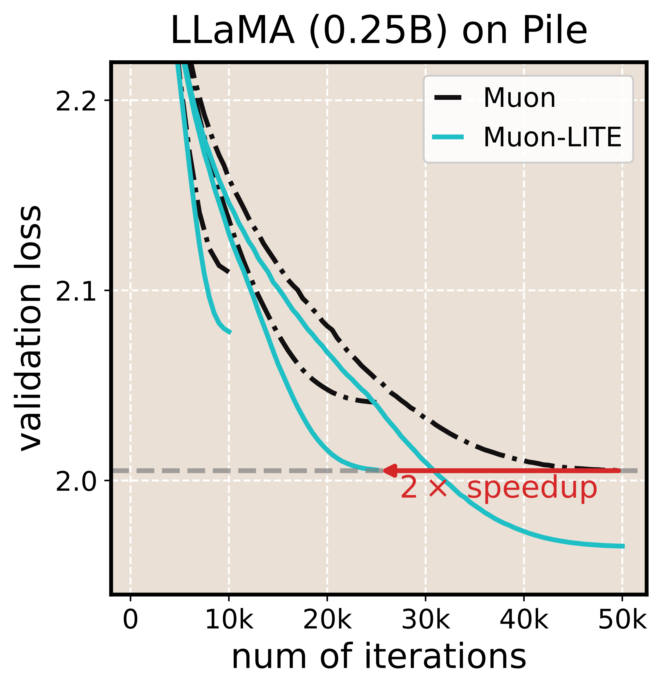
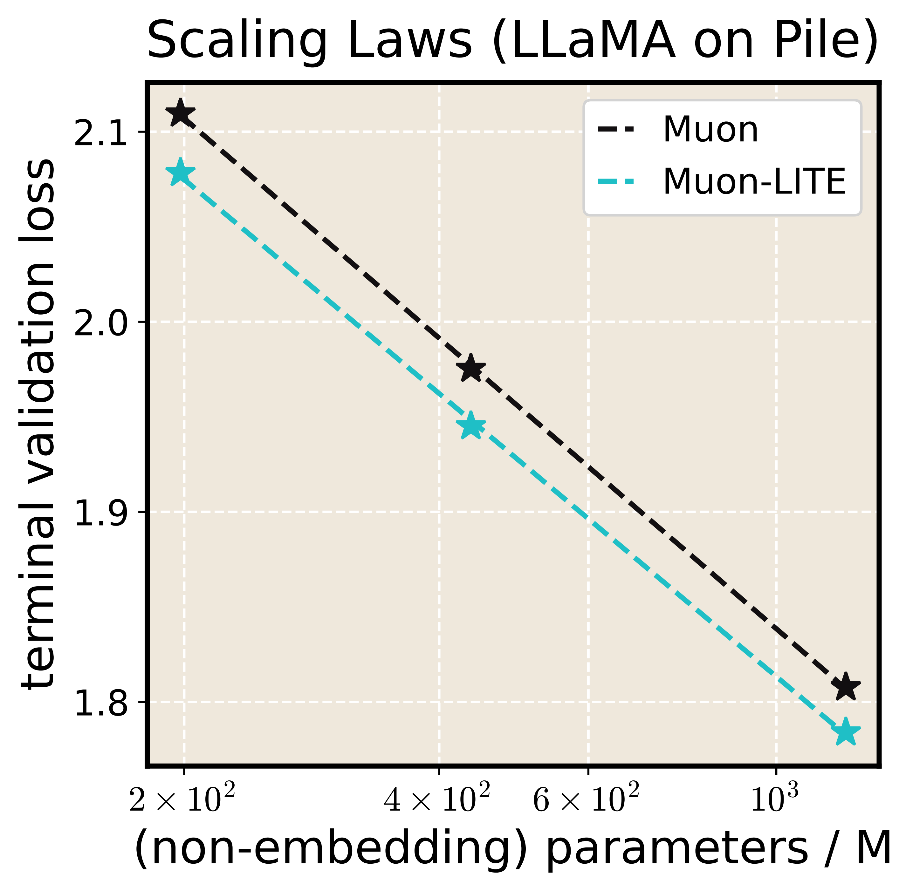
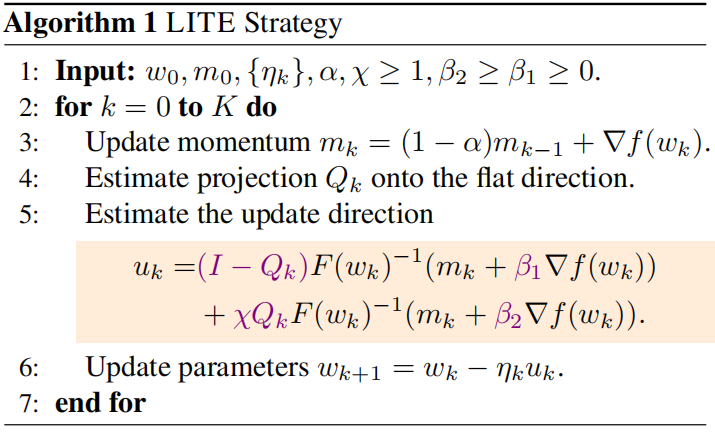

# LITE: Accelerating LLM Pre-Training through Flat-Direction Dynamics Enhancement

## Introduction
We introduce **LITE**, a generalized strategy for accelerating LLM pre-training by enhancing flat-direction training dynamics. LITE significantly improves the data efficiency and model size scaling laws of base optimizers.

<div align="center">
<table>
<tr>
    <td align="center"></td>
    <td align="center"></td>
    <td align="center"></td>
</tr>
</table>
</div>

<div align="center">
  
</div>

## Requirements

To reproduce the experiments for  Qwen2MoE  models, strict version control of the `transformers` library is required.

> [!IMPORTANT]
> **Version Warning:** > * Versions too low lack `DataCollatorWithFlattening`.
> * Newer versions (official implementation) trigger automatic fusion of the up/gate layers and may cause other errors.
> * **Recommendation:** We recommend using appropriate versions such as 4.51.0.


## Download the Pile (uncopyrighted) dataset

We use [the Pile (uncopyrighted) dataset](https://huggingface.co/datasets/monology/pile-uncopyrighted) for our experiments. Run the following command to download the dataset to your local directory:

```python
pip install -U huggingface_hub
``` 

```python
huggingface-cli download monology/pile-uncopyrighted \
--repo-type dataset \
--local-dir /your_path \
--local-dir-use-symlinks False
```

### Code Structure

The repository is organized as follows:

**Training Scripts**:
- `pretrain_pile_llama2/qwen2moe.py`: Script for pre-training LLaMA2/Qwen2MoE models on the Pile dataset.

**Bash Scripts**:
- `Muon_1B_pile.sh`: Pre-trains a 1.3B LLaMA2 model using the vanilla Muon optimizer (RMSNorm alignment version).

- `Muonlite_1B_pile.sh`: Pre-trains a 1.3B LLaMA2 model using the Muon-LITE optimizer.

- (Other bash scripts follow a similar naming convention for different configurations.)


### Example
A quick start:

We use [SwanLab](https://docs.swanlab.cn/guide_cloud/general/what-is-swanlab.html) for experiment tracking (`pip install swanlab`). This tool can be substituted with other alternatives if needed. Before running the scripts, please ensure you have set your SwanLab API token within the `pretrain_*.py` scripts.

To start pre-training the 1.3B LLaMA2 model with Muon-LITE:

```python
bash Muonlite_1B_pile.sh
```


### Acknowledgement
This implementation is based on code from [Galore](https://github.com/jiaweizzhao/GaLore).


